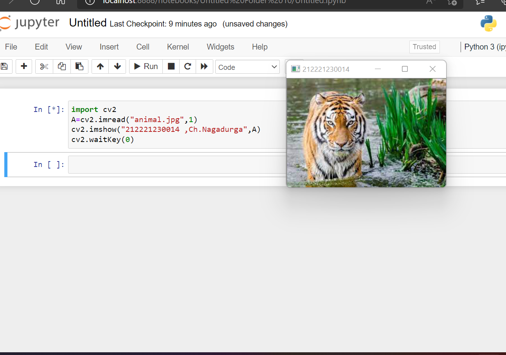
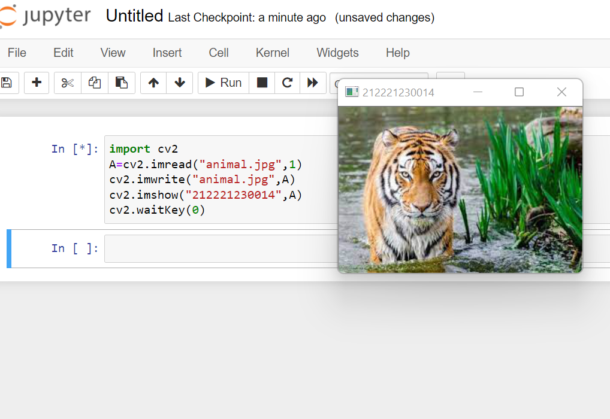
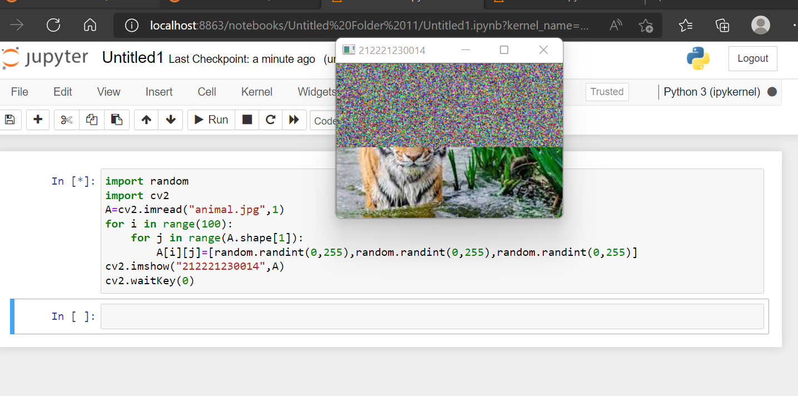
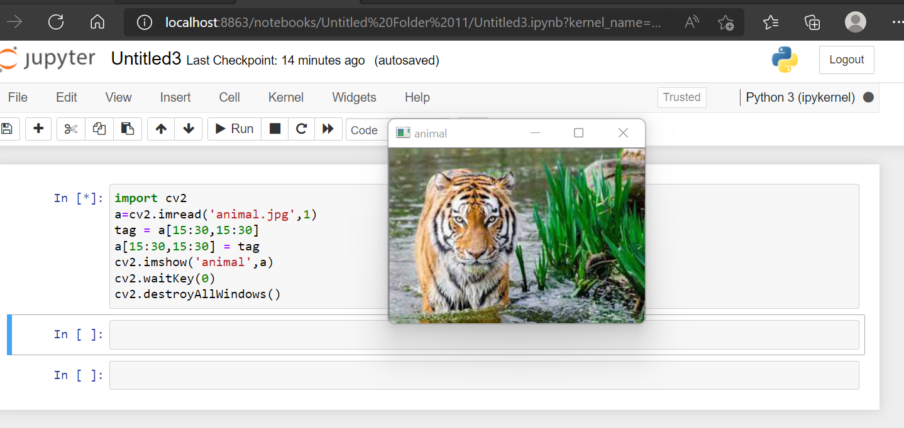

#  READ AND WRITE AN IMAGE
## AIM
To write a python program using OpenCV to do the following image manipulations.
i) Read, display, and write an image.
ii) Access the rows and columns in an image.
iii) Cut and paste a small portion of the image.

## Software Required:
Anaconda - Python 3.7
## Algorithm:
### Step1:
Choose an image and save it as a filename.jpg
### Step2:
Use imread(filename, flags) to read the file.
### Step3:
Use imshow(window_name, image) to display the image.
### Step4:
Use imwrite(filename, image) to write the image.
### Step5:
End the program and close the output image windows.

## Program:
python
# Developed By:Valasareddy pallavi
# Register Number:212221230059

# To Read,display the image
A=cv2.imread("animal.jpg",1)
cv2.imshow("212221230014",A)
cv2.waitKey(0)
# To write the image

import cv2
A=cv2.imread("animal.jpg",1)
cv2.imwrite("animal.jpg",A)
cv2.imshow("212221230014",A)
cv2.waitKey(0)

# Find the shape of the Image

import random
import cv2
A=cv2.imread("animal.jpg",1)
for i in range(100):
    for j in range(A.shape[1]):
        A[i][j]=[random.randint(0,255),random.randint(0,255),random.randint(0,255)]
cv2.imshow("212221230014",A)
cv2.waitKey(0)

# To access rows and columns
import random
import cv2
A=cv2.imread("animal.jpg",1)
for i in range(100):
    for j in range(A.shape[1]):
        A[i][j]=[random.randint(0,255),random.randint(0,255),random.randint(0,255)]
cv2.imshow("212221230014",A)
cv2.waitKey(0)

# To cut and paste portion of image
import cv2
a=cv2.imread('animal.jpg',1)
tag = a[15:30,15:30]
a[15:30,15:30] = tag
cv2.imshow('animal',a)
cv2.waitKey(0)
cv2.destroyAllWindows(0)

## Output:

### i) Read and display the image

### ii)Write the image

### iii)Shape of the Image

### iv)Access rows and columns

### v)Cut and paste portion of image

## Result:
Thus the images are read, displayed, and written successfully using the python program.